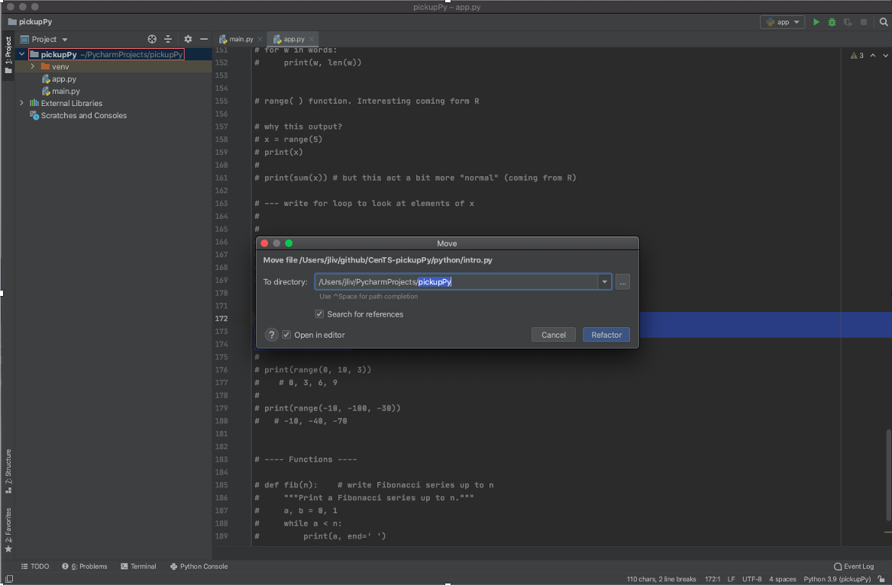

## My experience opening PyCharm after our initial meeting.
 
 1. It didn't like working on a file that was not part of a project. 
 The best I could tell it placed it in a temporary dir and then couldn't find it upon reopening PyCharm.
 (Good thing we source controled it with Github)
 
 2. When adding adding intro.py to the project (click and drag method) I got the message 
 
 So we need to figure out what this refectoring is all about
 
 This bring me to my next observation. Python feels more developmental.
 
